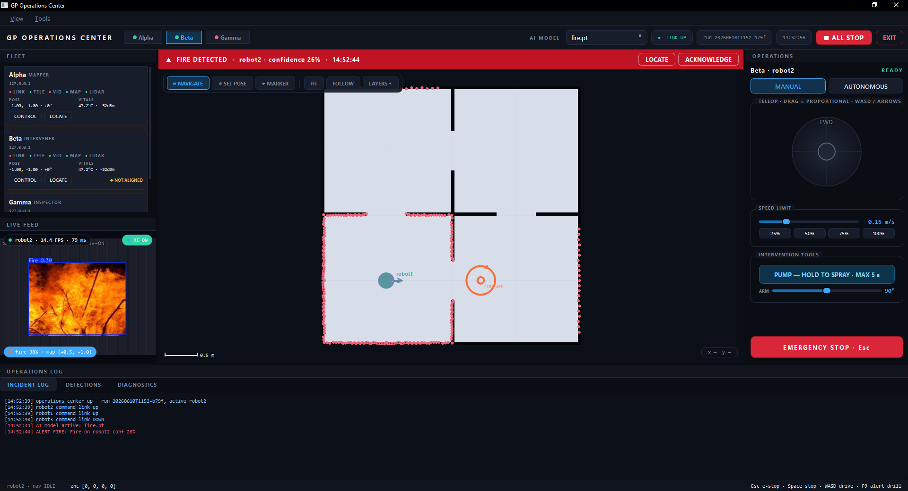

# GP — Swarm Emergency Robotics Platform

**Three specialized robots. One operations center. Explore, detect, intervene.**

A multi-robot emergency-response system: a LiDAR mapper builds the shared map,
a camera-equipped intervener detects and extinguishes fires, a gas inspector
patrols and alarms — all commanded from a native operations console with live
AI fire detection, global path planning, and a four-layer safety chain.



---

## The Fleet

| Robot | Role | Compute | Capabilities |
|---|---|---|---|
| **Alpha** · robot1 | Mapper | Raspberry Pi 4 + Arduino Mega | RPLidar A1 → SLAM (slam_toolbox), autonomous wall-following exploration |
| **Beta** · robot2 | Intervener | Raspberry Pi 3B+ + Arduino Mega | Camera (YOLO fire detection), encoder+IMU odometry, point-to-point navigation, **water pump + servo arm** |
| **Gamma** · robot3 | Inspector | ESP32 | MQ-5 gas sensor with latched local alarm, ultrasonic, IMU, OTA-updatable |

## The Operations Center (`dashboard_qt/`)

A native PySide6 console designed map-first: the shared SLAM map is the
central instrument; every other panel (fleet rail, live AI video, teleop,
log/detections/diagnostics drawer) is a dock you can rearrange, float, or
hide — the layout persists between sessions.

- **Global path planning** — click anywhere: A\* over the inflated occupancy
  grid routes *through doorways, away from walls*; the console feeds the
  robot one straight leg at a time and aborts loudly if it stalls.
  Unreachable targets answer `NO PATH`, not a collision.
- **AI fire detection → map** — YOLO runs in a crash-isolated child process;
  confirmed detections are projected along the camera bearing onto the map
  as merged, position-smoothed incident markers (one fire = one marker),
  with an acknowledgeable pulsing alert banner, audible alarm, and a
  detections table. Press **F9** for a labeled drill.
- **Shared-map multi-robot localization** — robot1's SLAM frame is the world;
  other robots are dropped onto the map once with the **SET POSE** tool
  (click = position, drag = heading; RViz-style) and every pose, detection,
  and goal click is transformed between frames from then on.
- **One-click SLAM reset** — **RESET MAP** on the map toolbar restarts the
  mapper's robot stack; the console clears markers and routes while the map
  rebuilds from scratch.
- **Professional teleop** — proportional virtual joystick (drag = continuous
  speed/turn, spring-back stop) and WASD, both feeding a 10 Hz deadman-guarded
  command stream; speed presets; per-robot E-STOP; fleet-wide **ALL STOP**.
- **Remote diagnostics** — per-robot panel: live vitals (undervoltage flags,
  temp, RSSI, load) plus one-click SSH actions: ping, service status,
  restart stack, restart camera, collect an incident log bundle, reboot.
  The ESP32 gets ping + its self-served web UI.
- Zero-hardware development: `--sim` spawns a full simulated robot (arena,
  raycast LiDAR, physics, test video with real fire imagery) speaking the
  production protocol bit-for-bit.

## Architecture

```
   ROBOT 1 · Pi 4                ROBOT 2 · Pi 3B+              ROBOT 3 · ESP32
   RPLidar → slam_toolbox        camera_pub (own systemd       MQ-5 + buzzer
   explorer · bridge · gateway   unit) · bridge · odom ·       HTTP API · OTA
   ROS 2 island (domain 11,      goto · gateway                command watchdog
   localhost-only DDS)           ROS 2 island (domain 12)      WiFi self-heal
        │ ZMQ 5556-5560               │ ZMQ 5555-5560               │ HTTP
        └───────────────┬─────────────┴──────────────┬─────────────┘
                        ▼                            ▼
              versioned msgpack protocol     (docs/protocol.md)
              telemetry · map · video · health · ACKed commands
                        │
                        ▼
              GP OPERATIONS CENTER  (Windows laptop, PySide6)
              map+planner · YOLO child process · alerts · diagnostics
```

**No DDS over WiFi.** Each Pi is a self-contained ROS 2 island
(`ROS_LOCALHOST_ONLY=1`); the per-robot *gateway* is the only network
doorway, speaking a sequence-numbered, ACKed msgpack/ZMQ protocol with
per-stream freshness tracking. (A robot-side rosbridge can still be enabled
per launch argument for ROS-level debugging.)

**Four-layer safety chain.** Console drive stream (10 Hz) → gateway deadman
(0.6 s) → bridge deadman (0.8 s) → firmware watchdog (1–2 s, also kills the
pump). On top: a latched end-to-end e-stop down to firmware (`E`/`X`), pump
hard-limited to 5 s runs in firmware, servo clamped and slew-limited.

## Quick start

**Console — zero hardware (recommended first run):**
```bash
pip install -r dashboard_qt/requirements.txt && pip install -e common
python dashboard_qt/main.py --sim
```
Drive with the joystick or WASD, click NAVIGATE across rooms and watch the
planned route, press F9 for an alert drill. Add `pip install ultralytics torch`
for the live fire-detection overlay (without it the console runs with an
explicit *AI OFF* badge).

**Console — real robots:** `python dashboard_qt/main.py`
(hosts/ports/calibration all live in `config/*.yaml`).

**Robots (one-time per Pi):**
```bash
cd ~/GP && pip3 install -e common pyzmq
./systemd/install_systemd.sh robot1        # or robot2 — installs udev rules too
sudo systemctl start gp-robot1             # preflight gates the launch
```
Fallback at any time: `./rasp_cmd/robotN.sh` (supervised tmux stack).

**Robot 3:** copy `config_secrets.h.template` → `config_secrets.h` with your
WiFi credentials, flash `firmware/robot3_controller_v2/`; later updates go
over the air (Arduino IDE → network port `robot3`).

## Firmware

| Sketch | Target | Status |
|---|---|---|
| `firmware/robot1_controller_v3` | Mega 2560 | ✅ compile-verified (2% flash) — non-blocking parser, watchdog-honest diagnostics |
| `firmware/robot2_controller_v5` | Mega 2560 | ✅ compile-verified (9% flash) — pump (5 s hard limit), slew-limited arm servo, e-stop latch, ACKed commands |
| `firmware/robot3_controller_v2` | ESP32 | ✅ compile-verified (79% flash, 16% RAM) — command watchdog, WiFi self-heal, latched gas alarm, OTA, secrets out of source |
| `arduino/robot2_controller_v4` + v1 sketches | Mega/ESP32 | ✅ kept as compile-verified flash-back rollbacks |

Every firmware change goes through `docs/bench_robot2_v5.md` (power-budget
gate + hardware-in-the-loop drills, including pull-the-cable-mid-spray)
before it touches a robot.

## Verification

| Layer | How |
|---|---|
| Logic (91 pytest tests) | protocol envelope/ACK/dedupe/deadman, serial parsers, odometry math, goto controller, **A\* planner (must route through the door, never the wall)**, frame alignment & detection projection, alert debounce/latch (incl. the `fire hydrant` ≠ fire regression) |
| Protocol live | `tools/soak_test.py --host <robot> --minutes 30` — KPI gates: loss <1 %, video ≥12 fps, ack p95 ≤150 ms, map ≤2 s |
| Console | full sim mode with fault injection (`--drop-video-at`, `--kill-at`); real fire imagery exercises detection → alert → map end-to-end |
| Firmware | arduino-cli compile verification + bench runbook |
| Demo day | `docs/runbook_demo_day.md` — roles, T-60/T-30 checklists, mid-demo recovery levers |

## Repository map

```
common/gpcore/      ROS-free core: protocol, serial parsers, kinematics, config, logging
gateway/            robot-side ZMQ gateway (ROS topics ⇆ network protocol)
robots/             launch files (respawn + run_id), preflight, scan watchdog, camera unit
dashboard_qt/       Operations Center (ui/, transport/, state/, inference/, sim/)
firmware/           current sketches (robot1_v3 · robot2_v5 · robot3_v2)
arduino/            flash-back rollbacks (robot1_controller · robot2_controller_v4 · robot3_controller)
navigation/         ROS 2 nodes: bridges, odometry, goto, explorer
mapping/            slam_toolbox launch + tuned config
config/             every host, port and calibration constant in one place
systemd/            service units + udev serial rules + installer
tools/              soak_test · baseline_probe · collect_logs · model probes · NoMachine profiles
tests/              91 tests — run on Windows and the Pis
docs/               protocol spec · demo runbook · wiring manuals · bench checklist · design notes
```

## Known limitations (honest engineering)

- Monocular fire ranging is an **estimate** (bearing is solid; distance from
  bounding-box size, clamped 0.4–4 m). Markers are incident indicators, not
  survey points.
- robot2/3 dead-reckon: re-run SET POSE when drift accumulates. robot1 *is*
  the map frame.
- robot1 has no point-to-point controller (it's the autonomous mapper);
  click-to-navigate executes on robot2.

---

*Graduation project — built on ROS 2 Humble, ZeroMQ + msgpack, PySide6,
Ultralytics YOLO, slam_toolbox.*
